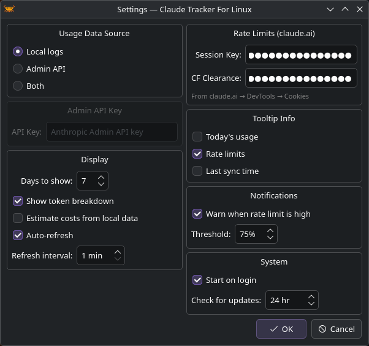
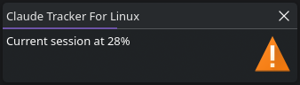

# Configuration

Open settings from the tray menu (**Right-click → Settings**).

{ width="560" }

## Usage Data Source

Choose where CTFL reads token usage data. See [Data Sources](data-sources.md) for details.

| Option | Description |
|---|---|
| **Local logs** | Reads from `~/.claude/projects/` — no API key needed |
| **Admin API** | Fetches from the Anthropic Admin API |
| **Both** | Merges both sources |

## Display

| Setting | Default | Description |
|---|---|---|
| **Days to show** | 7 | Number of days shown in the usage popup (1–90) |
| **Show token breakdown** | On | Show input/output token split in bar charts |
| **Estimate costs from local data** | Off | Calculate costs from local logs using public pricing |
| **Auto-refresh** | On | Periodically refresh usage data |
| **Refresh interval** | 1 min | How often to refresh (1–60 minutes) |

## Rate Limits

To see plan utilization from claude.ai, you can provide cookies from your browser:

| Field | Description |
|---|---|
| **Session Key** | Your `sk-ant-sid...` cookie from claude.ai |
| **CF Clearance** | The `cf_clearance` cookie value |

!!! note
    If you use Claude Code, CTFL automatically reads your OAuth token from `~/.claude/.credentials.json`. The session key fields are an alternative for users who don't use Claude Code.

## Tooltip Info

Choose what appears in the tray icon tooltip on hover:

- **Today's usage** — total tokens used today
- **Rate limits** — current session/weekly utilization
- **Last sync time** — when data was last refreshed

## Notifications

| Setting | Default | Description |
|---|---|---|
| **Warn when rate limit is high** | On | Show a desktop notification when utilization exceeds the threshold |
| **Threshold** | 75% | The utilization percentage that triggers a warning |

## System

| Setting | Default | Description |
|---|---|---|
| **Start on login** | Off | Create an autostart entry for your desktop environment |
| **Check for updates** | 24 hr | How often to check GitHub for new releases (0 = disabled, max 168 hr) |
