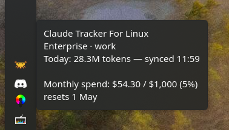

# Data Sources

CTFL can read usage data from multiple sources. Configure this in **Settings → Usage Data Source**.

## Local logs

Reads Claude Code conversation files from `~/.claude/projects/`. This is the default — no API key needed.

Provides:

- Token counts (input/output) per conversation
- Per-project and per-model breakdowns
- Cost estimates (optional, based on public pricing)

### Multi-account setups (CCS)

If you use [CCS](https://github.com/kaitranntt/ccs) to juggle several Claude accounts, CTFL discovers each instance under `~/.ccs/instances/*/` alongside the legacy `~/.claude/` directory and lets you switch between them.

By default CTFL **auto-detects** the active profile:

1. Scans running `claude` processes for `CLAUDE_CONFIG_DIR` — so whichever profile you just launched wins.
2. Falls back to the instance with the most recent JSONL activity when no session is running.

You can also pin a specific profile via the tray menu (**Right-click → Profile**). See [Configuration → Profile](configuration.md#profile).

## Admin API

Fetches organization-level usage from the [Anthropic Admin API](https://docs.anthropic.com/en/docs/administration/admin-api). Requires an admin API key.

Provides:

- Accurate token counts and costs from Anthropic's billing data
- Organization-wide usage (not just local conversations)

To set up:

1. Go to **Settings → Admin API Key**
2. Enter your Anthropic Admin API key
3. Set data source to **Admin API** or **Both**

## Both

Merges data from local logs and the Admin API. Use this to get the most complete picture — local project breakdowns combined with accurate API billing data.

## OAuth / Rate limits

CTFL reads your Claude Code OAuth credentials (`.credentials.json` inside the active profile directory) to fetch plan utilization directly from `claude.ai`. Pro and Max plans expose a session (5-hour) window and multiple weekly windows (All models, Sonnet, Claude Design), each with its own reset time; Enterprise plans expose a monthly spend window instead, shown as used / cap credits.

This happens automatically if you're logged into Claude Code — no configuration needed. Token refresh is handled transparently. When you switch profiles, CTFL re-reads credentials from the newly selected instance, so the utilization you see always matches the account you're currently using.

The rate limit data appears in:

- The tooltip (if enabled)
- The usage popup's rate limits section
- Desktop notifications when utilization exceeds the configured threshold

{ width="380" }
