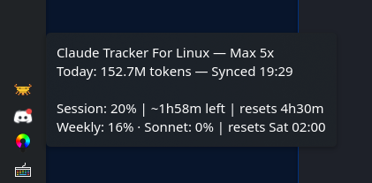
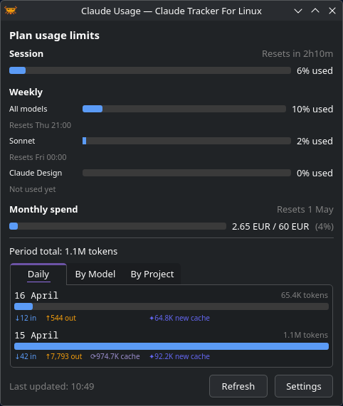
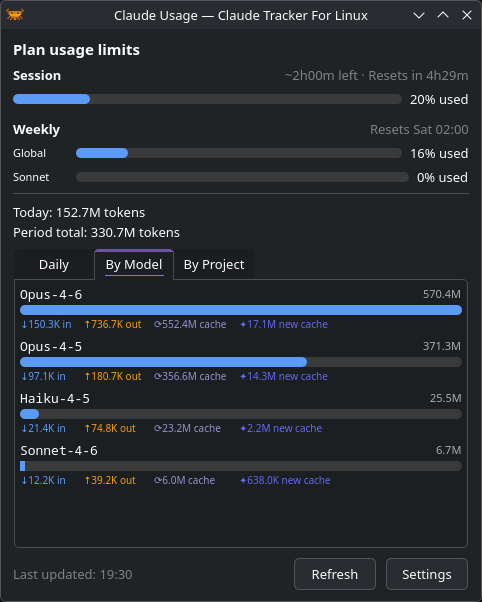

# Getting Started

## Launching

Launch from your application menu or run:

```bash
ctfl
```

CTFL starts as a system tray icon.

## Basic interactions

- **Left-click** the tray icon to toggle the usage popup
- **Right-click** for the context menu (refresh, settings, check for updates, quit)
- **Hover** over the icon to see a quick summary in the tooltip



## Usage popup

The popup shows your token usage in several views:

- **Daily** — bar chart of tokens per day
- **Models** — breakdown by Claude model
- **Projects** — breakdown by working directory

{ width="380" }
{ width="380" }

Long lists scroll inside the tab instead of stretching the popup off-screen, so raising **Days to show** in Settings is safe.

Above the charts, the popup surfaces plan rate-limit bars fetched from `claude.ai`. Pro and Max plans show session (5-hour) and weekly bars; Enterprise plans show a monthly spend bar with used / cap credits. The same figures appear in the tooltip when it is enabled.

### Long-context usage hint

When recent activity is dominated by large conversations, the popup surfaces a hint under the period total, for example:

> Recent sessions: 61% of tokens used at >150k context · `/compact` mid-task, `/clear` between tasks

Each message you send to Claude re-includes the whole conversation. Once the context passes ~150k tokens, each further reply is much more expensive — even with prompt caching. If you see this hint, running `/compact` mid-task or `/clear` when switching to unrelated work significantly reduces rate-limit burn.

The hint is computed over recent (JSONL-logged) sessions, not the full displayed period — older data aggregated by Claude Code's stats cache doesn't include per-message context size, so only the recent window can be measured.

## Next steps

- [Configure data sources](data-sources.md) to choose where CTFL reads usage data
- [Customize settings](configuration.md) to tailor the app to your workflow
