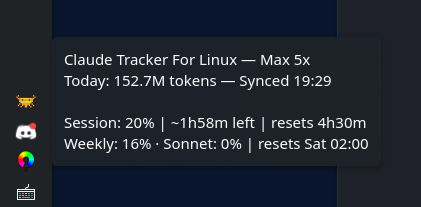
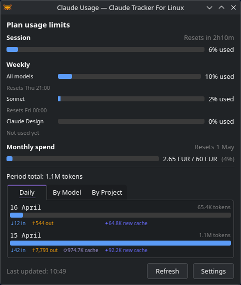
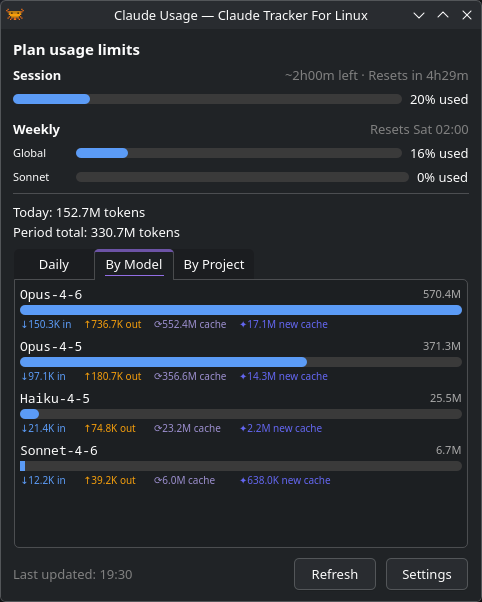
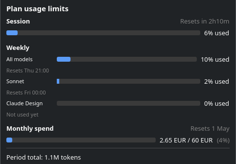

# Getting Started

## Launching

Launch from your application menu or run:

```bash
ctfl
```

CTFL starts as a system tray icon.

## Basic interactions

- **Left-click** the tray icon to open the usage popup, or to bring it to the front if it is already open behind another window. Clicking again while it is in front closes it.
- **Right-click** for the context menu (refresh, settings, check for updates, quit)
- **Hover** over the icon to see a quick summary in the tooltip



## Usage popup

The popup shows your token usage in several views:

- **Daily** — bar chart of tokens per day
- **Models** — breakdown by Claude model
- **Projects** — breakdown by working directory

{ width="380" }
{ width="380" }

Long lists scroll inside the tab instead of stretching the popup off-screen, so raising **Days to show** in Settings is safe. The first time it opens, the popup sizes itself to fit the tallest tab, so switching tabs never moves the window.

Above the charts, the popup surfaces plan rate-limit bars fetched from `claude.ai`. Pro and Max plans show a session (5-hour) bar plus one bar per weekly bucket the API reports, each with its own reset timestamp. **All models** is always present; alongside it you may see per-model buckets such as **Fable**, and **Claude Design** in its own section. The exact set follows your plan and what Anthropic exposes, so it changes over time without a CTFL update.

A **monthly spend** bar appears whenever usage credits are configured — on Max and Pro as well as Enterprise — showing used / cap. It stays visible once credits are exhausted, which is precisely when the number matters. The same figures appear in the tooltip when it is enabled.

{ width="480" }

Buckets you haven't used yet (for example, Claude Design before first use) show **Not used yet** in place of a reset time, and are omitted from the compact tray tooltip.

### Long-context usage hint

When recent activity is dominated by large conversations, the popup surfaces a hint under the period total, for example:

> Recent sessions: 61% of tokens used at >150k context · `/compact` mid-task, `/clear` between tasks

Each message you send to Claude re-includes the whole conversation. Once the context passes ~150k tokens, each further reply is much more expensive — even with prompt caching. If you see this hint, running `/compact` mid-task or `/clear` when switching to unrelated work significantly reduces rate-limit burn.

The hint is computed from the conversation logs Claude Code still keeps on disk. With **Days to show** capped at 30, that is normally the whole displayed period; a day whose logs Claude Code has already cleaned up is left out of the measurement.

## Next steps

- [Configure data sources](data-sources.md) to choose where CTFL reads usage data
- [Customize settings](configuration.md) to tailor the app to your workflow
