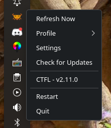
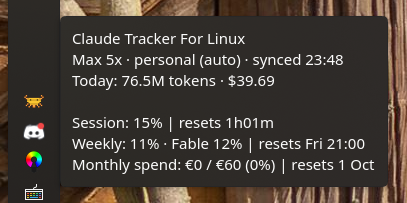
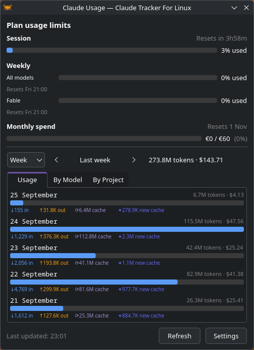
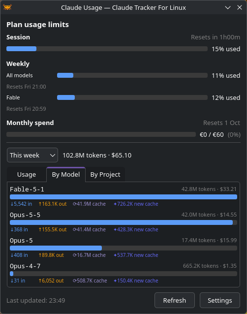
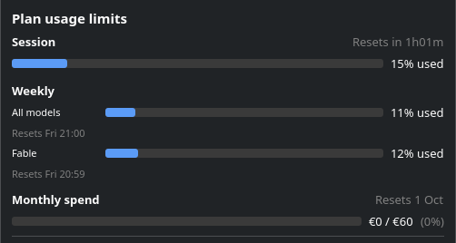

# Getting Started

## Launching

Launch from your application menu or run:

```bash
ctfl
```

CTFL starts as a system tray icon.

## Basic interactions

- **Left-click** the tray icon to open the usage popup, or to bring it to the front if it is already open behind another window. Clicking again while it is in front closes it.
- **Right-click** for the context menu: **Refresh Now**, **Profile** (when more than one is found, see [Profile](configuration.md#profile)), **Settings**, **Check for Updates**, the version entry (opens About), **Restart** and **Quit**
- **Hover** over the icon to see a quick summary in the tooltip




## Usage popup

Pick a period in the dropdown under the plan limits: **Today**, **This week** or **This month**. Its total sits next to the dropdown, and the three tabs cover that period:

- **Usage** — tokens per day
- **By Model** — breakdown by Claude model
- **By Project** — breakdown by working directory

{ width="380" }
{ width="380" }

The week starts on your locale's first day of the week, and CTFL remembers the period you picked. With **Estimate costs from local data** turned on in [Settings](configuration.md#display), the total, each day and each model also show an estimated cost at API list prices.

The popup sizes itself to its content: the list shows three to seven rows and scrolls beyond that, so the window cannot be resized, and switching tabs never changes its size. It is an ordinary window, so it stays open when you click another application.

Above the charts, the popup surfaces plan rate-limit bars fetched from `claude.ai`. Pro and Max plans show a session (5-hour) bar plus one bar per weekly bucket the API reports, each with its own reset timestamp. **All models** is always present; alongside it you may see per-model buckets such as **Fable**, and **Claude Design** in its own section. The exact set follows your plan and what Anthropic exposes, so it changes over time without a CTFL update.

A **monthly spend** bar appears whenever usage credits are configured — on Max and Pro as well as Enterprise — showing used / cap. It stays visible once credits are exhausted, which is precisely when the number matters. The same figures appear in the tooltip when it is enabled.

{ width="480" }

Buckets you haven't used yet (for example, Claude Design before first use) show **Not used yet** in place of a reset time, and are omitted from the compact tray tooltip.

## Next steps

- [Configure data sources](data-sources.md) to choose where CTFL reads usage data
- [Customize settings](configuration.md) to tailor the app to your workflow
